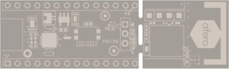

Tutorial 1: Linking Your Afero Development Board
================================================

Follow these simple steps to set up your Afero dev board:

1.  If you haven’t already, go to the [Afero Developer Portal Welcome page](https://developer.afero.io), where you’ll find links to:
    
    *   Install the Afero mobile app (iOS or Android) on your smartphone, and
    *   Download the Afero Profile Editor (Windows or macOS) on your computer.
    
    There’s also a “quick link” to the Hardware Products page for ordering Afero hardware development boards.
    
2.  Open the Afero mobile app on your smartphone, then follow the prompts to sign up for your Afero developer account.
3.  Plug your ’ into a micro-USB power source, either an AC adapter or your computer (not your smartphone).
4.  Scan the Afero dev board QR code using your smartphone.
5.  Wait while your dev board is linked to your account. When the picture of your Afero dev board appears on the screen, swipe through the screens to learn more and turn your board’s LED light on and off from your phone.

Congratulations! You’ve just controlled an embedded device from your smartphone through the Cloud!