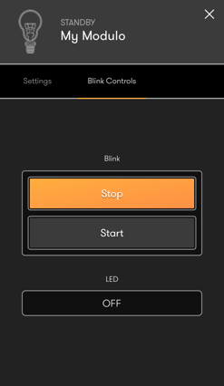
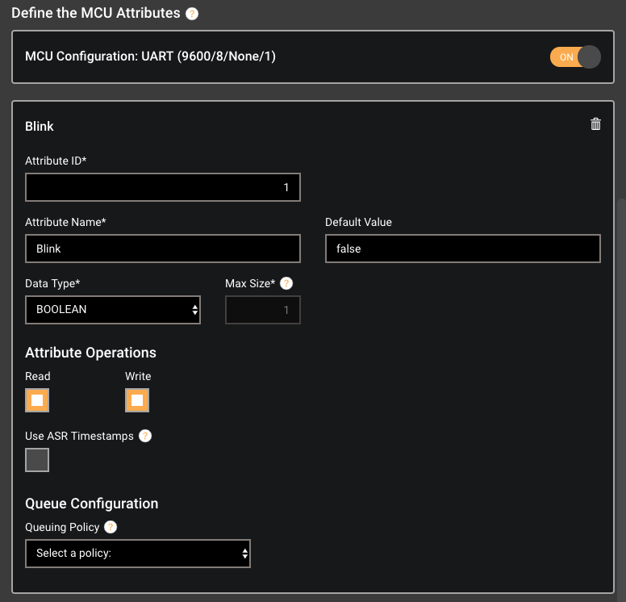
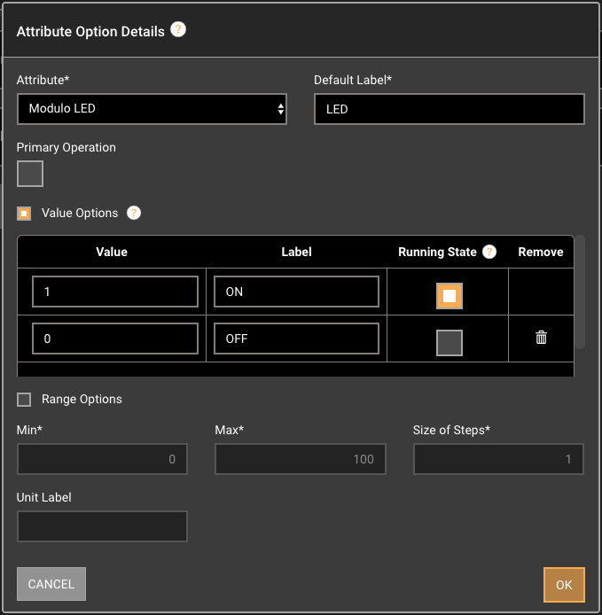
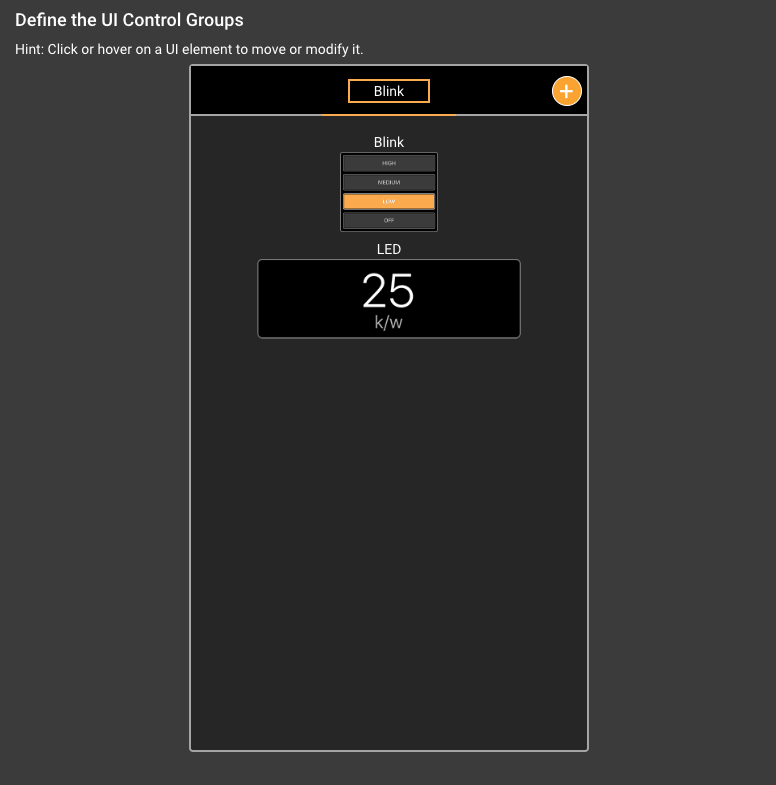

Tutorial 3: Afero + Arduino
===========================

In Tutorial 2 we looked at a device Profile that used only GPIO attributes and involved no external MCU. In this lesson we’ll add an Arduino as an example of an MCU that communicates with the Afero Secure Radio. This will demonstrate how you can incorporate ASR into a more complex product.

This project will provide the mobile user a start/stop control for LED blinking. When the user taps Start, an MCU attribute is set, which tells the Arduino to start a loop that blinks the LED on and off. This blinking will continue until the app user taps the Stop control to halt it.

In addition, the mobile app UI will demonstrate the use of a second control, used as a read-only indicator, that reflects the state of the blinking LED in real-time. When the LED is blinking on the development board, the remote mobile app will provide a blinking display as well:



First, we’ll run through the example, then take a closer look at how it all works.

Before You Begin
----------------

Be sure you’ve done the following before starting the steps below:

*   You’ve downloaded, installed, and signed in to the Afero mobile app and the Afero Profile Editor.
*   You have an Afero development board.
*   You've got an Arduino-compatible MCU, such as an Arduino Uno, plus an Afero Plinto shield for the most basic examples, or preferably a PJRC “Teensy” MCU (from pjrc.com or elsewhere) for a more powerful MCU so you don’t have to worry about memory or processing power while you're learning the platform.
*   You’ve connected your development board to your Arduino. Refer to the [Data Sheet](HWRef) appropriate for your development board if needed.
*   You have the Arduino IDE (1.8 or later) up and running, and have installed the Teensy Arduino support package from [https://www.pjrc.com/teensy/td\_download.html](https://www.pjrc.com/teensy/td_download.html) if you’re using a Teensy MCU.

The Steps
---------

1.  Download and install afLib for Arduino:
    1.  You can obtain afLib by going to [http://github.com/aferodeveloper/afLib](http://github.com/aferodeveloper/afLib).
    2.  Follow your [IDE instructions](https://www.arduino.cc/en/Guide/Libraries) on how to install the library.
    3.  afLib contains an Examples directory. In this directory, you’ll find an Arduino sketch as well as a directory containing an Afero device Profile that can be published to your Modulo.
    4.  The examples live in your Documents directory under Arduino/libraries/afLib/examples/.
2.  If you haven’t already done so, register your Afero development board to your account by scanning the QR code on your dev board using the Afero mobile app.
3.  Load the afBlink Profile in Afero Profile Editor:
    1.  From the Profile Editor start page, select the Open button.
    2.  In the Open dialog, navigate to Arduino/libraries/afLib/examples/afBlink/profile/
    3.  Open the device Profile directory that is appropriate for your developer device.
4.  From the Afero mobile app, make sure your developer device is connected.
5.  Go to the Publish tab in the Afero Profile Editor and check that your device is online and selected.
6.  Click Publish. The Profile will be uploaded over-the-air and in about a minute you should see the UI on your smartphone update to the new Profile UI.
7.  Now that the developer device is all set, let’s update the Arduino:
    1.  Open the Arduino IDE and from the File menu, select Examples > afLib > afBlink.
    2.  Make sure the Board and Port are set correctly in the Tools menu.
    3.  With the afBlink sketch open, select Upload from the Sketch menu.
    4.  Once the sketch has uploaded, open the Serial Monitor to see output from the example.
8.  Open the Afero mobile app and have some fun controlling your LED! The uppermost control, labeled “Blink”, lets you start and stop blinking; the lower control, labeled “LED”, displays the state of the module LED in real-time.

How It Works
------------

This section gives you a bit more insight into what’s happening behind the scenes.

### Define the Attributes

The device Profile in this lesson has two GPIO attribute definitions similar to those in Tutorial 2, but has an additional MCU attribute. This MCU attribute is a Boolean, made Writeable so that clicks in the mobile app UI can set the attribute value. We’ve named that attribute “Blink” because it will turn on/off the blinking of the LED.



### Define the Attribute Options

We plan to use menu controls to represent the two GPIO attributes defined in this project. We’d like to have user-friendly labels representing the GPIO values in the mobile app UI. To do this, we’ll define attribute options consisting of Value Options, as follows.

*   For the “Blink” attribute, which is set as the Primary Operation:

*   Value option “false” is mapped to label “Stop”.
*   Value option “true” is mapped to label “Start” and set to Running State. This will make the device icon highlight when blinking starts.

*   For the "Modulo LED" attribute:

*   Value option “1” is mapped to label “ON” and set to Running State.
*   Value option “0” is mapped to label “OFF”.



### Define the UI Controls

As described earlier, our mobile app UI will consist of two controls: a Menu control linked to the Blink attribute, and a read-only Text Box control, linked to the Module LED attribute. Assuming you’ve worked through Tutorial 2, you’ll find it simple to define these UI Controls.

Note that although this device Profile has three attributes, we define only two UI controls. There is no requirement that every attribute you define has a corresponding UI control; UI controls are required only for attributes that must be viewable and/or modifiable via the mobile app UI.

### Define a UI Control Group

Remember that every UI control must be a member of a UI Control Group even if it’s the only member. In this case, we’ll create a single Control Group, named “Blink Controls” and place both controls into it.

Since both controls belong to the same group, they will both be visible on the same screen in the Afero mobile app. If your application has many controls, you should organize them into groups that will make functional sense to the user when displayed together.



As you saw when you ran through the lesson, this Profile results in a mobile app UI consisting of buttons that control the Modulo LED: tap Start and the LED starts blinking; tap Stop and the blinking stops. While the LED is blinking, the “LED" control in the Afero mobile app UI will also change its label to reflect the LED state.

### What’s Happening on the MCU

Recall that when the UI gets a tap on the Start control, a message to the Afero Cloud tells the MCU program to start blinking the LED on the Modulo. Here’s the Arduino console output when we tap the Start button in the app UI to start the blinking, and after letting the LED blink a few times, tap Stop to halt:

```
13:15:54.865 -> attr BLINK=true
13:15:54.903 -> attr BLINK=true
13:15:54.975 -> attr Modulo LED=1
13:15:56.944 -> attr Modulo LED=0
13:15:58.946 -> attr Modulo LED=1
13:16:00.931 -> attr Modulo LED=0
13:16:02.932 -> attr Modulo LED=1
13:16:04.628 -> attr BLINK=false
13:16:04.666 -> attr BLINK=false
```

In the first line of output we see the MCU program logging execution of `attrEventCallback()`. We know from the [afLib API](API-afLib) that the MCU runs `attrEventCallback()` when ASR has executed `af_lib_set_attribute*()`. So we know that ASR must have called `af_lib_set_attribute*()` to tell MCU to set attribute 1 to value 1, and the MCU is handling that. How does that happen?

Take a look at the MCU’s `attrEventCallback()` definition (some code snipped out for clarity):

```
// This callback is executed any time ASR has information for the MCU
void attrEventCallback(const af\_lib\_event\_type\_t eventType,
                       const af\_lib\_error\_t error,
                       const uint16\_t attributeId,
                       const uint16\_t valueLen,
                       const uint8\_t\* value) {
  printAttribute(attributeId, valueLen, value);

  switch (eventType) {

  // SNIP //
  
    case AF\_LIB\_EVENT\_MCU\_SET\_REQUEST:
      // Request from ASR to MCU to set an MCU attribute, requires a call to af\_lib\_send\_set\_response()
      switch (attributeId) {
        case AF\_BLINK:
          // This MCU attribute controls whether we should be blinking.
          blinking = (\*value == 1);
          // We just echo back what the ASR sent us, to let it know we were successful
          // If we can't set this value, we'd return false below and value would be the "old"
          // value that the update didn't affect
          af\_lib\_send\_set\_response(af\_lib, AF\_BLINK, true, valueLen, value);
          break;

        default:
          break;
      }
      break;

  // SNIP //

    default:
      break;
  }
}
```

What’s happening here is that the user’s tap in the mobile app UI goes up to the Afero servers as a message to change the value of attribute #1 (AF\_BLINK). The message results in a call to `attrEventCallback()` that specifies a request has been made to set the value of MCU attribute AF\_BLINK. In response, the MCU code above sets a local variable, `blinking`, to the new value of the AF\_BLINK attribute. It then calls `af_lib_send_set_response()`, which it must to do confirm that the change was made.

Back to the console output, where we see several lines containing `attrEventCallback` calls with attribute ID AF\_MODULO\_LED. You probably recognize that the alternating 0’s and 1’s reflect that the LED is being blinked.

Based on the [afLib API](API-afLib), we know that `attrEventCallback()` is executed by the MCU whenever ASR sends an update message about an attribute change. So we deduce that ASR is sending updates every time it changes the value of GPIO 0 (the LED). The one piece of the puzzle we haven’t seen is what’s making ASR change that value. One more look at the code:

```
void loop() {
  // ALWAYS give the afLib state machine time to do its work....
  af\_lib\_loop(af\_lib);

  // SNIP //

  // Flash the LED whenever the 'blinking' value is true
  if (blinking) {
    if (millis() - lastBlink > BLINK\_INTERVAL) {
      setModuloLED(!moduloLEDState);
      lastBlink = millis();
    }
  }
}
```

And there it is: while variable “blinking” is true, the MCU calls `setModuloLED()` every BLINK\_INTERVAL (0.5 seconds) to set the GPIO attribute to the opposite state. In response to that call, ASR updates the attribute, and then sends an update message, which causes the MCU to execute `attrEventCallback()`.

!!! note In a typical product containing an MCU, any LED indicator in the device would likely be connected directly to the MCU, whereas in this example we have used the LED on the dev board. The difference is that in this lesson, the MCU changes the LED state by making a `af_lib_set_attribute()` call, which causes ASR to make the change and send an update; whereas in a product, the MCU would probably set the LED directly. We used this design not only for setup simplicity, but also to emphasize the way attributes are affected by making `af_lib_set_attribute()` calls.

  

The flow above illustrates the basic messaging pattern:

1.  A user action on the mobile app UI becomes a message to set the value of an attribute on a specific device.
2.  The app sends the “set attribute value” message to the Afero Cloud, which broadcasts the message.
3.  The ASR for the targeted device receives the message that the attribute value should be set.
4.  ASR does a couple of things:
    
    1.  Stores the attribute’s current value and the new desired value.
    2.  Tells the MCU that the attribute value should be set to the desired value.
5.  When the MCU gets the message, `attrEventCallback()` executes. In that call, you must write code to enable the MCU to make a state change that will correspond to the desired attribute value. This will typically involve some device action (e.g., starting LED blinking).
6.  After `attrEventCallback()` runs, afLib informs ASR, which then:
    
    1.  Stores the new current value of the attribute, which should equal the desired value.
    2.  Sends the attribute value back to the Afero Cloud.
7.  The Afero Cloud broadcasts the new attribute value.
8.  The mobile app receives the broadcast and updates the UI, so the end-user knows the request has been filled.

System Attributes
-----------------

Up to this point, we’ve confined ourselves to discussing attributes that you, the developer, define using the Afero Profile Editor. It turns out that every device Profile you define also includes several other attributes defined automatically by the system. These are called **system attributes**.

### Attribute Types and ID Ranges

As you know, when you author an MCU sketch for Afero Secure Radio, you must include the `device-description.h` file generated by the Afero Profile Editor. The `device-description.h` file consists of #defines for all attributes, both user-defined and system-defined. Different types of attributes are organized into ranges based on ID. Let’s take a look in that file:

```
#define ATTRIBUTE\_TYPE\_BOOLEAN                                     1
#define ATTRIBUTE\_TYPE\_SINT8                                       2
#define ATTRIBUTE\_TYPE\_SINT16                                      3
#define ATTRIBUTE\_TYPE\_SINT32                                      4
#define ATTRIBUTE\_TYPE\_SINT64                                      5
#define ATTRIBUTE\_TYPE\_Q\_15\_16                                     6
#define ATTRIBUTE\_TYPE\_UTF8S                                      20
#define ATTRIBUTE\_TYPE\_BYTES                                      21

// SNIP //

// Attribute Blink
#define AF\_BLINK                                                     1
#define AF\_BLINK\_SZ                                                  1
#define AF\_BLINK\_TYPE                           ATTRIBUTE\_TYPE\_BOOLEAN

// Attribute Modulo LED
#define AF\_MODULO\_LED                                             1024
#define AF\_MODULO\_LED\_SZ                                             2
#define AF\_MODULO\_LED\_TYPE                       ATTRIBUTE\_TYPE\_SINT16

// SNIP //

// Attribute Command
#define AF\_SYSTEM\_COMMAND                                      65012
#define AF\_SYSTEM\_COMMAND\_SZ                                      64
#define AF\_SYSTEM\_COMMAND\_TYPE                  ATTRIBUTE\_TYPE\_BYTES

// Attribute ASR State
#define AF\_SYSTEM\_ASR\_STATE                                    65013
#define AF\_SYSTEM\_ASR\_STATE\_SZ                                     1
#define AF\_SYSTEM\_ASR\_STATE\_TYPE                ATTRIBUTE\_TYPE\_SINT8

// SNIP //
```

In the sample above, you can see that the file begins with a set of defines that simply provide names for the data types that will be described in the remainder of the file.

Following that, you should see something that looks familiar: the define for the AF\_BLINK attribute. We used the name AF\_BLINK to refer to attribute #1 in the sketch we developed earlier in this exercise. At this point we’ll note two features of this attribute:

*   The Blink attribute you defined using the Profile Editor is an MCU attribute, and
*   The attribute ID = 1.

It turns out that any MCU attributes you define will have ID numbers from 1 to 1023. Of course, you should use the #define names for the attributes and not their ID numbers, but we raise this point here because the ID range defines the number of MCU attributes you can create, and to introduce the fact that different types of attributes have different ID ranges.

After the definition of AF\_BLINK, you see another attribute you created: AF\_MODULO\_LED. This is one of the GPIO attributes you defined in your Profile. GPIO attributes start at ID 1024, and each GPIO has a pair of attributes:

*   One for the base definition (what you defined in the Profile), and
*   One for extended attribute definition data (you don’t have to worry about this)

Thus, GPIO 0 owns IDs 1024 and 1025, GPIO 1 owns 1026 and 1027, and so on.

Starting with ID 2001 and above, you’ll see attribute definitions that you did not create when you defined your device Profile. Above 65000, the attributes have names that start with “AF\_SYSTEM\_”. These are the system attributes. We won’t describe all of the system attributes here, though most have names that explain their purpose clearly enough. In general, you can ignore these attributes, but because they are defined in the `device-description.h`, you can access them in your sketch. In fact, one of these attributes is critically important for you as the author of MCU code: the AF\_SYSTEM\_ASR\_STATE attribute.

### The AF\_SYSTEM\_ASR\_STATE Attribute

In most cases, you can ignore the system attributes, but when your project includes an MCU, you’ll need to pay attention to the AF\_SYSTEM\_ASR\_STATE (a.k.a. ASR\_STATE) attribute. That’s because this attribute is used to provide your MCU code important status information about your ASR in real-time.

The ASR\_STATE attribute can have one of a small range of values, or “states”:

*   0 = Rebooted
*   1 = Linked
*   2 = Updating
*   3 = Update Ready to Apply (Reboot Requested)
*   4 = Initialized
*   5 = Re-Linked
*   6 = Factory Reset

Let’s take a look at how your code can use three of these events:

*   [0 = Rebooted](ASR_State-0)
*   [4 = Initialized](ASR_State-4)
*   [3 = Update Ready to Apply (Reboot Requested)](ASR_State-3)

#### What to Do When You Receive the “Rebooted” State Message

The event callback will receive AF\_SYSTEM\_ASR\_STATE “Rebooted” whenever ASR has been rebooted. After a reboot, ASR is not ready to act on requests from afLib until it has signaled by sending the AF\_SYSTEM\_ASR\_STATE “Initialized”.

A typical way to respond to the Rebooted state is to set a variable that indicates your code should hold off on afLib requests until it hears that ASR is Initialized. In skeleton form, this might look like:

```
volatile bool asrReady = false;          // If false, wait for AF\_MODULE\_STATE\_INITIALIZED; if true, OK to communicate with ASR
volatile bool asrRebootPending = false;  // If true, reboot is needed, e.g. if we received an OTA firmware or profile update.

// SNIP //

void attrEventCallback(const af\_lib\_event\_type\_t eventType,
                       const af\_lib\_error\_t error,
                       const uint16\_t attributeId,
                       const uint16\_t valueLen,
                       const uint8\_t\* value) {

  switch (eventType) {
    case AF\_LIB\_EVENT\_ASR\_NOTIFICATION:
      switch (attributeId) {

        case AF\_SYSTEM\_ASR\_STATE:
          switch (value\[0\]) {

            case AF\_MODULE\_STATE\_REBOOTED:
              asrReady = false;   // Rebooted, so we we can't talk to it yet
              break;
  // SNIP //
            case AF\_MODULE\_STATE\_INITIALIZED:
              asrReady = true;
              break;
  // SNIP //
            }
          break;
  // SNIP //
    }
  }
}

void loop() {
  af\_lib\_loop(af\_lib);          // ALWAYS give the afLib state machine time to do its work

  // Until the ASR is initialized, we shouldn't talk to it, if it's not ready we just exit loop() altogether.
  if (!asrReady) return;

  // SNIP //
  
  // Application code here

}
```

#### Waiting Until Initialized

As noted above, ASR will send the AF\_SYSTEM\_ASR\_STATE “Initialized” message when it is ready to handle requests from afLib. Requests made before this message may lead to unexpected results. So, as seen in the example above, it is typical for MCU code to avoid making any afLib calls _before_ it receives the Initialized message. Note though, that even during the pre-initialized phase, the MCU code _must_ regularly call `af_lib_loop()`.

In the example above, you can see that we keep track of the pre-initialized state in the variable `asrReady`. The main `loop()` does nothing except call `af_lib_loop()` if `initializationPending` is true. Once the signal AF\_MODULE\_STATE\_INITIALIZED is received, `asrReady` is set to true, and the application code will run. Any time ASR is rebooted, though, `asrReady` is set once again set to false, and the code resumes waiting until it gets the all-clear.

#### How to Handle a Reboot Request

The status “Reboot Requested” means that ASR has received an over-the-air (OTA) software update, and requires rebooting for that update to be installed. If your project does not include an MCU, then the reboot will execute automatically, as soon as possible after the update has been received. However, if your project includes an MCU, then responsibility for triggering the reboot falls on the MCU code. This allows your MCU to restrict the ASR reboot to times that are safe for your application.

So, you need to watch for reboot requests, and you need to respond by signaling ASR to reboot – how exactly do you go about this? Well, of course, this is all about communication via attribute values!

1.  When ASR receives an OTA, it signals receipt by changing the value of the ASR\_STATE attribute.
2.  As we saw earlier in the example, whenever ASR sends an update message about an attribute, the MCU executes the `attrEventCallback()`.
3.  So, we’ll need to use our `attrEventCallback()` code to watch for a change to AF\_SYSTEM\_ASR\_STATE; and specifically, for that attribute to change to value 3 (AF\_MODULE\_STATE\_UPDATE\_READY).
4.  Once we see that condition, we’ll want to write something into our `attrEventCallback()` to trigger an ASR reboot. How can we do that? Set an attribute! It turns out that there’s another system attribute, AF\_SYSTEM\_COMMAND, that provides a way to trigger that reboot.

Here’s a detailed example:

```
volatile bool asrReady = false;          // If false, wait for AF\_MODULE\_STATE\_INITIALIZED; if true, OK to communicate with ASR
volatile bool asrRebootPending = false;  // If true, reboot is needed, e.g. if we received an OTA firmware or profile update.

// SNIP //

void attrEventCallback(const af\_lib\_event\_type\_t eventType,
                       const af\_lib\_error\_t error,
                       const uint16\_t attributeId,
                       const uint16\_t valueLen,
                       const uint8\_t\* value) {

  switch (eventType) {
    case AF\_LIB\_EVENT\_ASR\_NOTIFICATION:
      switch (attributeId) {

        case AF\_SYSTEM\_ASR\_STATE:
          switch (value\[0\]) {

            case AF\_MODULE\_STATE\_UPDATE\_READY:
              asrRebootPending = true;
              break;
  // SNIP //
            }
          break;
  // SNIP //
    }
  }
}

void loop() {
  af\_lib\_loop(af\_lib);          // ALWAYS give the afLib state machine time to do its work

  // Until the ASR is initialized, we shouldn't talk to it, if it's not ready we just exit loop() altogether.
  if (!asrReady) return;

  // asrReady == true from here on down
  // If we were asked to reboot (e.g. after an OTA firmware update), do it now.
  if (asrRebootPending) {
    int retVal = af\_lib\_set\_attribute\_32(af\_lib, AF\_SYSTEM\_COMMAND, AF\_MODULE\_COMMAND\_REBOOT, AF\_LIB\_SET\_REASON\_LOCAL\_CHANGE);
    // If retVal returns an error, leave asrRebootPending set to try it again next time around
    asrRebootPending = (retVal != AF\_SUCCESS);
    // if retVal returned success, then we wait for the ASR reboot to happen
    if (!asrRebootPending) {
      asrReady = false;
    }
  }

  // Application code here

}
```

In the above definition of `attrEventCallback()`, we check the supplied attribute ID, and if that ID is AF\_SYSTEM\_ASR\_STATE, we check the attribute value. If the value is 3 (AF\_MODULE\_STATE\_UPDATE\_READY), we’ve been asked to reboot ASR. We trigger that reboot by setting a global, `asrRebootPending`. In our main `loop()` function, any time `asrRebootPending` is true, we’ll call `af_lib_set_attribute_32()` for the AF\_SYSTEM\_COMMAND attribute, with value 1 (which is the value that signals a reboot). Notice that our code resets `asrRebootPending` to false if it succeeds; if the `set_attribute()` call fails, we’ll try again next time around the `loop()`.

Updated July 30, 2021

  

© 2015-2021 Afero | [Legal](https://www.afero.io/html/home/privacy.html) | [Privacy](https://www.afero.io/html/home/privacy.html#privacy) | [Afero Home](https://www.afero.io)

[]()