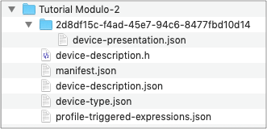

Profile Editor User Guide
=========================

Once you are set up for development, you are ready to work on your project. Each project developed to run within the Afero ecosystem is unique. You might rely solely on Afero Secure Radio (ASR) for processing and control, you might require hardware and software development for an in-product MCU that works with ASR, or you might be developing an Afero Secure Hub prototype.

Whatever your goal, you will start by creating a project using the Afero Profile Editor. This user guide steps you through everything you need to know to get started and create a device Profile:

*   [Select the Project](SelectProject)
*   [Define the Device Type](DeviceType)
*   [Define the Device Attributes](AttrDef)
*   [Define the Mobile App UI](AppUIDef)
*   [Publish Your Profile](Publish)

Before you start, read the next few sections to get an introduction to Device Types, device Profiles, and the Afero Profile Editor in general. You are also encouraged to step through [Tutorial 2: Creating a Device Profile](Lesson2) before creating your own device Profile.

The Device Type
---------------

The first step is to use the Profile Editor to create a Device Type, which includes a _name_ and _description_. Technically, the Device Type is not considered part of the Profile, but you do use the Profile Editor to define it. The Device Type is a key device identifier to the Afero Cloud. The Device Type definition is held in a .json file within your project directory. (More about the project directory structure below.)

The Device Profile
------------------

All projects require the definition of the communication interface between the Afero Platform and the device. That communication interface is called the device Profile and contains two parts:

*   **Device Attribute Definition** - A set of attributes whose values describe and control the state of your device. Attributes are specified in terms of function, data type, and read/write accessibility. For example, a thermostat would likely have the current room temperature as an attribute. Getting and setting attributes via the Afero Cloud is the heart of communication between the end-user and your device.
    
*   **Mobile App UI Definition** - Together with the communication interface, all projects must specify a user interface. After defining an attribute and giving it meaning, you must assign the attribute a standard presentation, which describes how it is represented to the end-user on the screen of the Afero mobile app.
    

We refer to these combined definitions as the device **Profile**.

At any time during development, it’s possible to check your project into a revision control system, share it, or import it for use as a template for another project.

About the Profile Editor
------------------------

The tool you will use to define your device Profiles is the Afero Profile Editor. The Profile Editor is available to all Afero partner-developers and can be downloaded for either [Windows](http://cdn.afero.io/latest-ape/win) or [macOS](http://cdn.afero.io/latest-ape/mac). For system requirements, go to the [Electron Supported Platforms](https://www.electronjs.org/docs/tutorial/support) page.

!!!! note
     **Chrome app users:** If you were previously using the Afero Profile Editor Chrome app, **remove** the Chrome app by going to `chrome://extensions/` in your browser, finding the Afero Profile Editor entry, then clicking the trash icon to the right.

  

The Profile Editor takes care of the following:

*   Declaration of a Device Type to the Afero Cloud.
*   Specification of the communication interface between a Device Type and the Afero ecosystem.
*   Definition of a set of standard UI elements that will be rendered in a mobile app UI to display Device Status and provide Device Control to the end-user.
*   Publication of the above information to the Afero Cloud.
*   Over-The-Air (OTA) installation of the device Profile to the ASR you are programming – whether that’s an Afero development board or an ASR installed in your product. (By the way, the examples we use in this section will assume we’re working with a Modulo; the operations are the same for any device module.)
*   Automatic generation of a project-specific header file that you’ll use with the afLib API, for projects that involve programming an in-product MCU.

Note that during project development you **do** need an active network connection. This is so Afero can provide checks against creating duplicate Device Types, refresh access tokens, and ensure integrity of the rules and notifications you define. If you do lose connectivity, the Profile Editor will notify you.

Project Structure
-----------------

An Afero project is similar to any development environment project; essentially, it’s a container for source files, output files, and a manifest that holds it all together:

Project files are complete and saved locally. This has a few practical implications:

*   **Use your preferred source control system.** Since all files are stored locally and the files comprising a project are all common types (text, image), your projects require no special treatment when used with a source control system. You are encouraged to use your preferred source control system to manage changes within your projects.
    
*   **You can freely copy and share projects.** Thanks to the simple structure of a Profile Editor project, you can freely duplicate projects, share them, or import one as a template to start another.
    
*   **To delete a project,** simply delete the project directory through your filesystem.
    

!!!! warning
     Avoid making edits directly on project files with tools other than the Afero Profile Editor. If you do, normal consistency checks and validation are bypassed, which could cause unexpected results.

  

Next: [Select the Project](SelectProject)

Updated July 30, 2021

  

© 2015-2021 Afero | [Legal](https://www.afero.io/html/home/privacy.html) | [Privacy](https://www.afero.io/html/home/privacy.html#privacy) | [Afero Home](https://www.afero.io)

