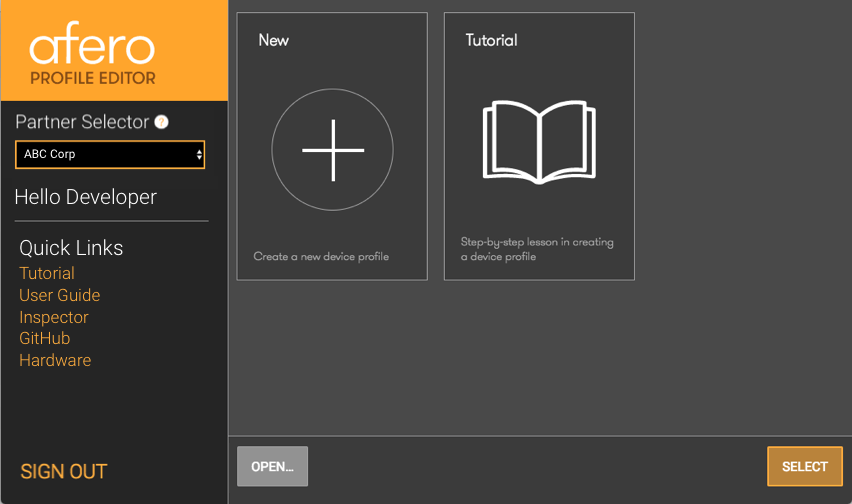
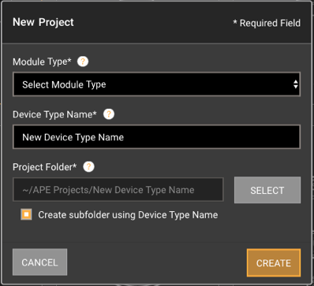
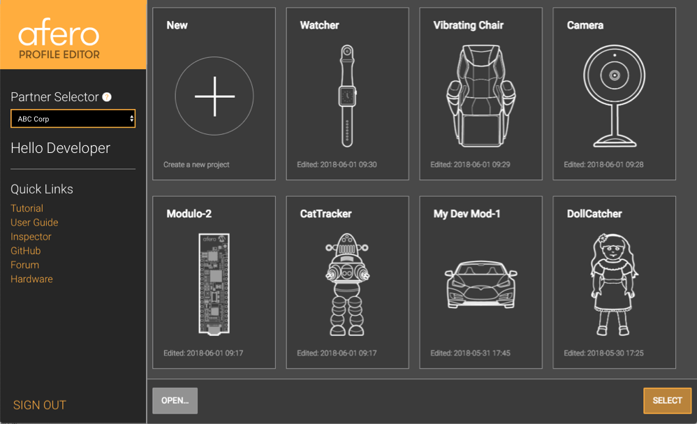
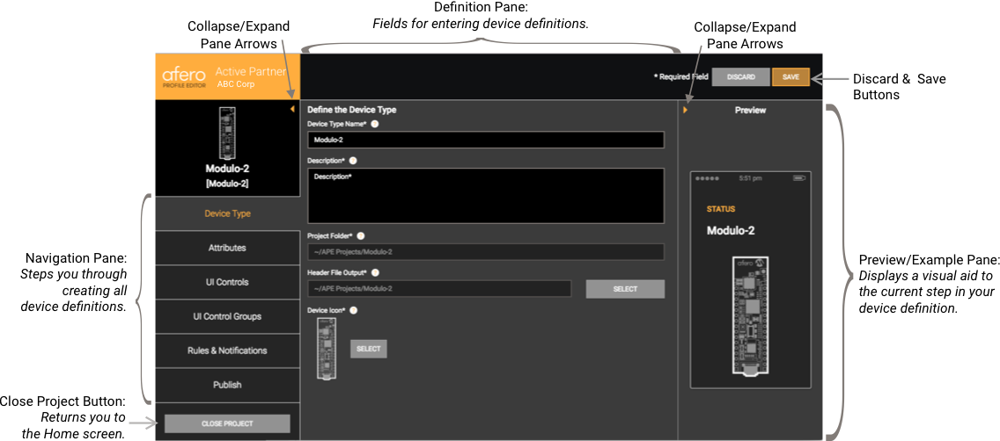

Select the Project
==================

When you first launch the Afero Profile Editor, the Startup window appears:

In the upper-left of the Startup window, you’ll see a Partner Selector. Assuming you have more than one partner, select the partner for whom you are developing the Profile. Below the Partner Selector you’ll see a personal greeting, and below your name, you’ll see links to the Profile Editor tutorial, developer documentation (including this Profile Editor User Guide), GitHub, and a page listing available Afero hardware. In the lower-left you’ll see a link for signing out.

In the center of the Startup window, assuming this is your first project, you’ll see a link to create a new projectand a link to the tutorial.

Create a New Project
--------------------

Select theicon to open the New Project dialog:

First you are asked to select which Afero Module Type you are using for your project. Then give your new project a Device Type Name. Note that the Device Type Name will be used as your default project name. Then navigate to a local working directory where you’d like your Profile Editor projects to be stored. You can either use the operating system to create a new, empty folder for your project in the selected working directory, or you can select the Create subfolder using Device Type Name checkbox to have a folder created for you.

When you’re ready, click Create. The Device Type definition window opens (described on the next page).

Before You Proceed
------------------

Creating your first project is straightforward, but you should know there is a restriction that could affect the naming of new projects, including cloning or opening existing projects. It’s best you understand this restriction before you get too far into creating projects:

**Once you have created a project and published the resulting Profile to a device, the _Device Type + Module Type_ combination specified in the project is _fixed_.**

For example, let’s say you create a project using Device Type “Motion Sensor” based on a Module Type “Modulo-1B” and you publish the Profile to your motion sensor device. Then you decide you’d also like to build a new motion sensor based on a Modulo-2. You would use the Profile Editor to clone your original “Motion Sensor” project but select Modulo-2 as the Module Type. Then, because you changed the Module Type, you would give the Device Type a new name.

Below is a matrix summarizing the constraints around the different cases. Note that in the cases where there is an existing Device Type, we assume it was defined in a profile that has been **published** to a device.

<table>
    <thead>
        <tr>
            <th>Case</th>
            <th>Create New Project</th>
            <th>Clone Existing Project</th>
            <th>Open&nbsp;Local&nbsp;Project</th>
        </tr>
    </thead>
    <tbody>
        <tr>
            <td>Device&nbsp;Type&nbsp;doesn’t&nbsp;exist.</td>
            <td>New project is created.</td>
            <td>Cloned project is opened.</td>
            <td>Project is opened.</td>
        </tr>
        <tr>
            <td>Device Type + Module Type does exist.</td>
            <td>
Before proceeding past the New Project dialog, you are notified that a project using that Device Type (+ Module Type) already exists and are asked to confirm that you want to use it. If you confirm, the Profile you create with this new project will replace the Profile already on the device.

            
Alternatively, you can provide a new Device Type name and could select a different Module Type.
</td>
            <td>
Before proceeding past the Clone Project dialog, you are notified that a project using that Device Type (+ Module Type) already exists and are asked to confirm that you want to use it. If you confirm, the Profile you create with this cloned project will replace the Profile already on the device.

            
Alternatively, you can provide a new Device Type name and could select a different Module Type.
</td>
            <td>Project is opened.</td>
        </tr>
        <tr>
            <td>Device Type does exist but with different Module Type.</td>
            <td>Before proceeding past the New Project dialog, you are asked to create a new Device Type or select the Module Type currently associated with the Device Type.</td>
            <td>Before proceeding past the Clone Project dialog, you are asked to create a new Device Type or select the Module Type currently associated with the Device Type.</td>
            <td>Project is opened to the Device Type window, but you cannot proceed until you provide a new Device Type name.</td>
        </tr>               
    </tbody>
</table>

Open or Clone a Project
-----------------------

The sections below give you more details on the different options you have for selecting a project: opening an existing project from the Startup page, cloning an existing project, or opening a local project.

### Open an Existing Project from the Startup Window

If you have created some projects, your most recently-opened projects will be shown on the Startup window in “panels”, with their project name, icon, and last edited time displayed:

Simply double-click the project’s panel to open the project, or select the panel and click the Select button. If you haven’t assigned a project an icon, the question mark iconwill be used. Projects open by default to the Device Type definition window, described further in [Define the Device Type](DeviceType).

### Clone an Existing Project

If you have a project you’d like to use as a starting point for another, first open the project you want to clone. Then go to the operating system menu bar and select File > Clone Project. The Clone Project dialog opens; proceed as you would when creating a new project, noting the restrictions described above in [Before You Proceed](#before-you-proceed).

### Open an Existing Project from the Filesystem

Click the Open button to navigate within your local filesystem to any Afero project that you saved using your Profile Editor or was shared with you by another developer. If the project you’re opening uses an existing Device Type, you’ll be prompted to create a new Device Type name, as described above in [Before You Proceed](#before-you-proceed).

Once you’ve opened a project, you’ll see the Device Type definition window, described further in [Define the Device Type](DeviceType).

Profile Editor User Interface
-----------------------------

Before going to the next section, let’s do a quick tour of the Profile Editor UI.

*   The system menu bar contains a few items worth noting. Select:
    
    *   File > New Project to begin a new project.
    *   File > Open Project to navigate to and open a saved project.
    *   File > Clear List to clear the Startup window of all the displayed projects.
    *   File > Clone Project to make a copy of your open project (menu item appears active when you have a project open). If you are defining a new Device Type with this project, make sure the Device Type Name you give it is unique across your projects, a name that you haven’t used before.
    *   View > Account Info to see information about your account: first name, last name, username, and authentication information. This includes your OAuth Client ID and OAuth Client Secret, which you’ll need when working with [Afero Cloud API endpoints](CloudAPIs).
    *   Tools > Sample Projects to download some projects we’ve posted to the [aferodeveloper GitHub site](http://github.com/aferodeveloper/APE-Project-Profiles). You can use these projects as starting points. To see all the projects we’ve created (not just those explicitly listed in the menu), select the GitHub Repository menu item. This menu selection will open the GitHub page where you can conveniently download a zip file of all the projects.
    *   Help > Collect Anonymous Usage Data to toggle this option on or off. Any data collected is anonymous and used only to help us improve the Profile Editor based on how you use it.
    *   With a Profile Editor project open:
        *   The leftmost section of the Profile Editor window is the Navigation pane. We’ll be working our way down the pane as we create a Profile. To close your current project, simply select Close Project at the bottom of the Navigation pane.
            
        *   The rightmost section, below the Discard and Save buttons, is the Preview/Example pane. Depending on what is displaying in the center pane of the window, you may see example views of the mobile app UI, the Afero dev board, or UI elements you’re working with.
            
        *   You can hide/show the Navigation pane on the left and the Preview pane on the right by clicking the arrows located at the top inside corners of the panes: . They work as toggles, showing/hiding the associated pane.
            
        *   In the upper-right of the window, you’ll see the Discard and Save buttons. These always act on the values in the currently-visible window.
            
        *   Selected checkboxes and radio buttons are partially filled with orange; deselected checkboxes and radio buttons are filled with dark grey.
            
        *   Selected options have an orange background (“OUTPUT” in the example); deselected options have a black background.
            
    
    Next: [Define the Device Type](DeviceType)
    
    Updated July 30, 2021
    

  

© 2015-2021 Afero | [Legal](https://www.afero.io/html/home/privacy.html) | [Privacy](https://www.afero.io/html/home/privacy.html#privacy) | [Afero Home](https://www.afero.io)

